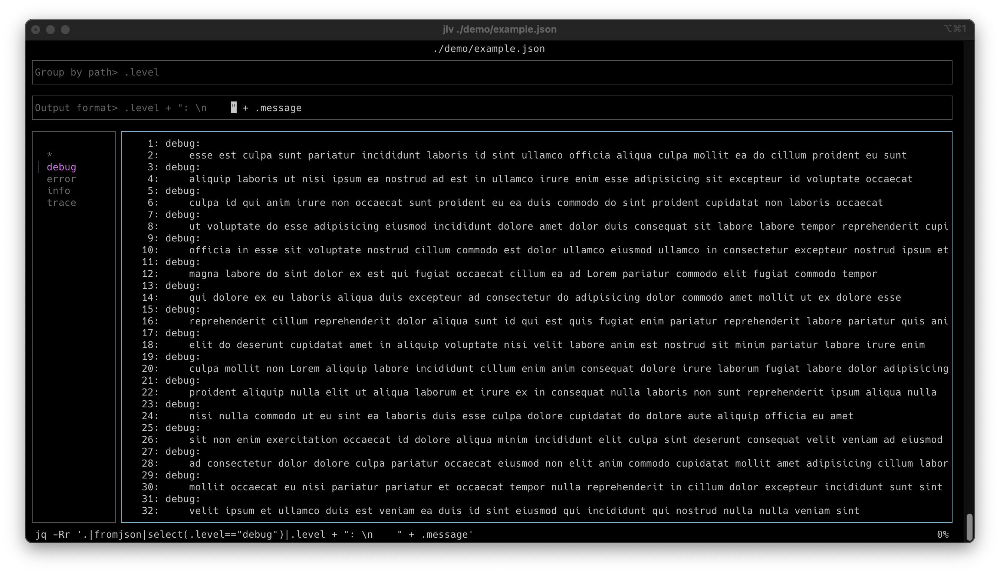

# jlv: JSON log viewer

## Overview

The JSON log viewer is a [bubbletea](https://github.com/charmbracelet/bubbletea)
TUI that helps explore logs made up of a series of JSON objects. It allows a
user to specify a `selector` which is the path to a field in the objects.
Objects without that field are hidden. The unique values of the field in the
objects will be used to populate the list.  When a value in the list is
selected, only ojects with that value for the selected field will be displayed.
The user can also specify an `output` format which will be used to select values
from each object to display.  By default, all objects are selected and pretty
printed. The equivalent `jq` command line is shown at the bottom of the screen.

The file is watched for appended lines. New lines that match the selector are
added to the groups list. New lines are displayed in the output window according
to the current format.  If the output window is scrolled to the bottom when new
lines arrive then the window will be scrolled to remain at the bottom.
Otherwise, the new lines will be appended off screen.



## Install

```bash
go install github.com/mrxk/jlv@latest
```

## Requirements

* head
* tail
* [jq](https://jqlang.org/)

## Usage

```
JSON log viewer: jlv

Usage:
	jlv [options] <path>

Options:
	<path>                               The path of the JSON file to watch.
	                                     "-" for stdin.
	-s <selector>, --selector=<selector> JSON path to grouping field.
	-o <format>, --output=<format>       Format of output.
	-l, --linenumbers                    Show line numbers.
	-w, --wrap                           Wrap output.
```

## Key bindings

### Global

* `esc`: quit the application
* `tab`: change focus to the next TUI element
* `shift-tab`: change focus to the previous TUI element

### Group list window

* `/`: fliter the list
* `down`: select the next item
* `up`: select the previous item
* `right`: select the next page
* `left`: select the previous page
* `PageDown`: select the next page
* `PageUp`: select the previous page

### Output window

* `f`: toggle between full-screen and windowed view
* `w`: toggle between wrapped and truncated view
* `l`: toggle line numbers
* `G`: scroll to the bottom
* `g`: scroll to the top
* `down`: scroll down
* `up`: scroll up
* `PageDown`: scroll down a page
* `PageUp`: scroll up a page

## Recorded demo

[demo](demo/README.md)
